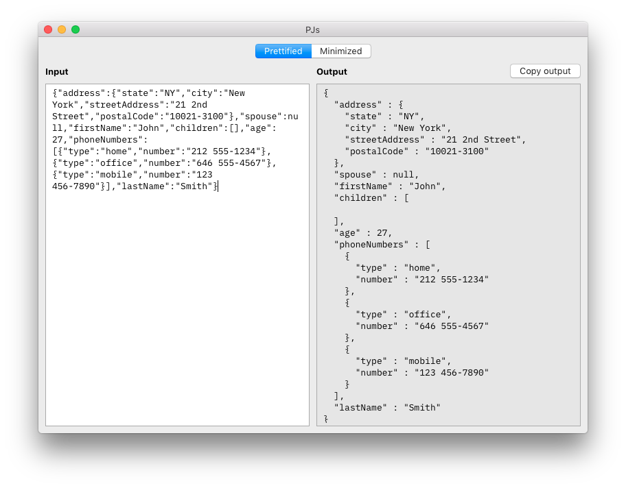

#  PJs - Pretty JSON

A simple, privacy minded macOS JSON formatter application. Making it easy to convert between minified and prettified JSON.

Simply put your JSON into the Input box and select your output option.

## Installation

### Current Version: 1.0.0

Download the latest release from [Releases](https://github.com/acrookston/pjs/releases).

Be aware that there is currently no automatic updating so please check back for updates.

## Contributing

This project is intended to be a safe, welcoming space for collaboration, and contributors are expected to adhere to the [Contributor Covenant](http://contributor-covenant.org) code of conduct.

Bug reports and pull requests are welcome via GitHub at https://github.com/acrookston/pjs/issues.

If you're making a big change, please open an Issue first, so we can discuss. Otherwise:

- Fork the repo
- Make your changes and add tests (if possible).
- Create a pull-request on Github.

## Author

Andrew Crookston [@acr](https://twitter.com/acr)

Tweet me if you like this library, have questions or feedback.
